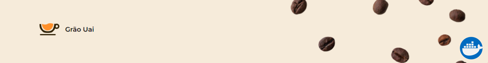

O Grão Uai é um projeto simples em React que nós desenvolvemos para demonstrar de forma prática o uso básico do `Docker`. Com o Docker, conseguimos criar um ambiente isolado para o projeto, facilitando a configuração e a execução da aplicação. Além disso, o Docker nos permitiu compartilhar facilmente o projeto, garantindo que todos tenham um ambiente de desenvolvimento consistente.

# Instalação

Para preparar o ambiente para ultilizar a aplicação:

- Instale o [Node.js](https://nodejs.org/en/), preferencialmente a versão LTS, em seu computador.
- Instale o [Docker](https://www.docker.com/).

# Passos para executar o projeto
1. Uma vez preparado o ambiente, clone o repositório e abra a pasta do projeto em sua IDE de preferência.

```
git clone (colocar link repositório)
```

2. Execute o comando abaixo para instalar as dependências do projeto:

```
npm install
```

3. No terminal, execute o seguinte comando para construir a imagem Docker:

```
docker build -t nome_da_imagem .
```

4. Após a conclusão da construção da imagem, execute o seguinte comando para iniciar um contêiner a partir da imagem:

```
docker run -p 3000:3000 nome_da_imagem
```
5. Logar na sua conta do docker, para conseguir publicar a imagem:

```
docker login
```

6. Execute o comando para definir uma tag para a imagen:

```
docker tag nome_imagem nome_do_hub/nome_imagem
```
7. Agora é só executar o push com o seguinte comando para subir a sua imagem para o docker hub:

```
docker push nome_do_hub/nome_imagem
```
Agora sera capaz de baixar a imagem pelo diretorio do docker e execuar em qualquer outro computador.

# Tecnologias


# Referencias
* [O mínimo que você precisa saber sobre Docker!](https://youtu.be/ntbpIfS44Gw)
* [Guia de iniciante do Docker](https://docs.docker.com/get-started/)
* [Docker Documentation](https://docs.docker.com/reference/)
* [Chat GPT](https://chat.openai.com/)
# Autores

<table style="width: 100%;">
  <tr>
    <td style="padding: 15px;">
      
    </td>
    <td style="padding: 13px;">
      
    </td>
    <td style="padding: 13px;">
      
    </td>
    <td style="padding: 13px;">
      
    </td>
        <td style="padding: 13px;">
      
    </td>
  </tr>
  <tr>
    <td style="text-align: center;">Arlan Trindade</td>
    <td style="text-align: center;">Anna Flávia Lopes</td>
    <td style="text-align: center;">Arthur Eduardo Silva</td>
    <td style="text-align: center;">Marcus Diniz</td>
    <td style="text-align: center;">Samuel Ferreira</td>
  </tr>
</table>